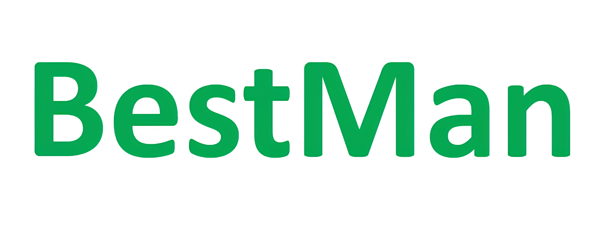

<!-- # BestMan_Flexiv - A Pybullet-based Mobile Manipulator Simulator -->
[](https://github.com/facebookresearch/home-robot/blob/main/LICENSE)
[](https://releases.ubuntu.com/20.04/)
[](https://releases.ubuntu.com/22.04/)
[](https://www.python.org/downloads/release/python-370/)
<!-- [](https://github.com/pre-commit/pre-commit)
[](https://github.com/psf/black)
[](https://timothycrosley.github.io/isort/) -->

Welcome to the BestMan_Flexiv repository, a codebase dedicated to the Flexiv robotic arm.

## 💻 Installation

- Clone the Repository

```
git clone https://github.com/yding25/BestMan_Flexiv.git
```

- Integrate with flexiv_rdk 
Ensure you have flexiv_rdk version 0.10. You can download it from [Flexiv Robotics GitHub](https://github.com/flexivrobotics/flexiv_rdk.git) or the [Flexiv RDK](https://rdk.flexiv.com/manual/getting_started.html#setup-and-run-python-rdk) Manual.
```
cd BestMan_Flexiv/Install
unzip flexiv_rdk.zip -d /home/[X]
mv BestMan_Flexiv /home/[X]/flexiv_rdk/
```
Note, Replace **[X]** with your account name.

- Create conda environment

```
cd ./flexiv_rdk/BestMan_Flexiv/Install
conda env create -f basic_environment.yaml
```

## 🔎 Project Structure
Generate and view the project structure:
```
tree -L 2 BestMan_Flexiv/ > BestMan_Flexiv/Asset/project_structure.txt
cat Asset/project_structure.txt
```

## 👨‍💻 Basic Demos
:shamrock: **Load Kitchens**

```
python Examples/load_kitchen.py
```

## 📧 Contact Information

If you have any questions or need further assistance, please feel free to reach out via email:
- dingyan at pjlab.org.cn
- Zhuoma Zhaxi at pjlab.org.cn


##  :handshake: Reference
- [IKPy’s documentation](https://ikpy.readthedocs.io/en/latest/index.html)
- [Flexiv RDK APIs](https://rdk.flexiv.cn/api/index.html)
